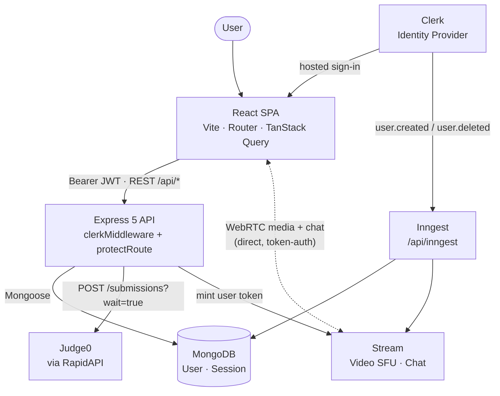

# INTERIX

> 🎯 Real-time technical interview platform — live video, chat, and a multi-language code editor with server-graded hidden tests.

**⚛️ React · 🚂 Express · 🍃 MongoDB · 📹 Stream · 🔐 Clerk · ⚙️ Judge0**

---

## 1. 🎯 Overview

INTERIX is a real-time technical interview platform. A host opens a session around a specific DSA problem, a second user joins it, and both sides share a live video call, a chat channel, and a Monaco-based code editor in the same room.

It solves the "three tabs" problem of mock interviews — video on one service, the problem statement on another, and the code somewhere else — by binding all three to a single session record. It is built for candidates practising interviews, peers running mock rounds, and interviewers who want to watch someone actually solve a problem.

What makes it technically interesting: authentication, real-time transport, and untrusted code execution are each delegated to a purpose-built provider (Clerk, Stream, Judge0), while the Express API stays the single source of truth for session state and — importantly — for the hidden test cases, which never reach the browser.

---

## 2. ✨ Features

### 🎥 Live interview sessions

* Create a session by picking a problem and a difficulty (easy / medium / hard).
* Browse all currently active sessions and join one as the participant.
* One host + one participant per session; the host is the only one who can end it.
* Ended sessions move to completed and show up in each participant's recent history.

### 💬 Real-time communication

* WebRTC video call (camera + microphone controls) powered by Stream Video.
* Text chat channel scoped to the same session, powered by Stream Chat.
* Both are keyed by the same `callId`, so joining the session joins both surfaces at once.

### 💻 Coding workspace

* Monaco editor with resizable panels: problem description · editor · output.
* Four languages: JavaScript, Python, Java, C++, each with its own starter code.
* Run executes your code as-is; Submit runs it against hidden test cases and returns a verdict (`Accepted`, `Wrong Answer`, `Runtime Error`, `Compilation Error`).
* Per-test detail on failure, and confetti on Accepted.

### 🔐 Accounts

* Clerk-hosted sign-in / sign-up; the SPA gates every route behind an active session.
* Users are mirrored into MongoDB and into Stream automatically — via a Clerk webhook, with a live fallback if the webhook was ever missed.

---

## 3. 🛠️ Tech Stack

| Technology                    | Layer           | Responsibility & why it's here                                                                                                         |
| ----------------------------- | --------------- | -------------------------------------------------------------------------------------------------------------------------------------- |
| **React 18 + Vite 5**         | Frontend        | SPA shell and build tooling; Vite for fast HMR and a static `dist` the API can serve in production.                                    |
| **React Router v7**           | Frontend        | Client-side routing for `/`, `/dashboard`, `/problems`, `/problem/:id`, `/session/:id`.                                                |
| **TanStack Query**            | Frontend        | Server-state cache for sessions — dedupes fetches, refetches after mutations, and removes hand-rolled loading state.                   |
| **Tailwind CSS v4 + daisyUI** | Frontend        | Utility styling plus a ready component layer, so no bespoke design system needs to be maintained.                                      |
| **Monaco Editor**             | Frontend        | The VS Code editor core — syntax highlighting and multi-language support without building an editor.                                   |
| **Express 5 (ESM)**           | Backend         | REST API, Clerk middleware mount point, Inngest handler, and static host for the built frontend.                                       |
| **MongoDB + Mongoose**        | Database        | Stores users and sessions; the document model fits a session's optional participant and embedded metadata naturally.                   |
| **Clerk**                     | Auth            | Full identity provider — hosted UI, session JWTs, and server-side `requireAuth()` verification. No password handling in this codebase. |
| **Stream (Video + Chat)**     | Real-time       | Managed SFU and chat infrastructure. Removes the need to run signalling servers, TURN, and message persistence.                        |
| **Judge0 (via RapidAPI)**     | Code execution  | Sandboxed multi-language execution. Untrusted user code never runs on the app server.                                                  |
| **Inngest**                   | Background jobs | Durable, retryable handling of Clerk `user.created` / `user.deleted` webhooks for user syncing.                                        |
| **axios**                     | Both            | HTTP client — a configured instance on the frontend, and the Judge0 caller on the backend.                                             |

> 📝 **Naming note:** `frontend/src/lib/piston.js` is a leftover filename. Code execution actually goes through **Judge0**, not Piston. Worth renaming.

---

## 4. 🏗️ Architecture



### 🔄 How responsibilities are split

* **Client** renders the UI, holds the Clerk session, calls the REST API, and — once it has a server-minted token — talks to Stream directly for media and chat. Media never transits the Express server.
* **Express API** owns session lifecycle (create / join / end / list), authorises every request through Clerk, provisions Stream call + chat channel resources, and proxies code execution. It never trusts a client-supplied user id.
* **MongoDB** persists only what the app owns: user mirrors (keyed by `clerkId`) and session documents (`problem`, `difficulty`, `host`, `participant`, `status`, `callId`).
* **Auth** is entirely Clerk. `protectRoute = requireAuth()` → look up the Mongo user by `clerkId` → attach it to `req.user`, self-healing by fetching from Clerk and upserting if the record is missing.
* **Real-time** is Stream. A single `callId` generated at session creation identifies the video call, the messaging channel, and the link back to the session document.
* **Code execution** is isolated in Judge0. The backend builds the submission (user code + hidden test driver from `backend/src/data/problems.js`), sends it out, and diffs the output to produce a verdict.
* **Background processing** is Inngest, serving Clerk webhooks at `/api/inngest` to keep Mongo and Stream user records in sync with retries.

---

## 5. 📁 Project Structure

```text
INTERIX/
├── package.json                  # root: build (frontend) + start (backend) for single-service deploy
├── CHANGELOG.md
│
├── backend/
│   ├── .env.example
│   └── src/
│       ├── server.js             # Express app, middleware, route mounting, static prod serve
│       ├── controllers/
│       │   ├── sessionController.js  # create / list / get / join / end
│       │   └── chatController.js     # Stream token minting
│       ├── routes/
│       │   ├── sessionRoute.js
│       │   ├── chatRoutes.js
│       │   └── codeRoutes.js         # Judge0 run + submit
│       ├── models/
│       │   ├── User.js
│       │   └── Session.js
│       ├── middleware/
│       │   └── protectRoute.js       # Clerk auth + user resolution/provisioning
│       ├── lib/
│       │   ├── env.js                # centralised env access
│       │   ├── db.js                 # mongoose connection
│       │   ├── stream.js             # Stream chat + video server clients
│       │   └── inngest.js             # Clerk webhook functions
│       └── data/
│           └── problems.js            # hidden tests + per-language drivers (server-only)
│
└── frontend/
    ├── .env.example
    ├── public/
    │   ├── hero.png
    │   └── language icons
    └── src/
        ├── main.jsx                 # Clerk + Query providers
        ├── App.jsx                  # routes + auth gating
        ├── pages/
        │   ├── HomePage
        │   ├── DashboardPage
        │   ├── ProblemsPage
        │   ├── ProblemPage
        │   └── SessionPage
        ├── components/
        │   ├── VideoCallUI
        │   ├── CodeEditorPanel
        │   ├── OutputPanel
        │   ├── ProblemDescription
        │   ├── ActiveSessions
        │   ├── RecentSessions
        │   ├── CreateSessionModal
        │   ├── StatCards
        │   └── Navbar
        ├── hooks/
        │   ├── useSessions.js          # TanStack Query wrappers
        │   └── useStreamClient.js      # joins call + chat channel, handles teardown
        ├── api/
        │   └── sessions.js             # typed-ish API surface over axios
        ├── lib/
        │   ├── axios instance
        │   ├── stream client
        │   ├── piston.js               # → Judge0
        │   └── utils
        └── data/
            └── problems.js              # public problem metadata + starter code (no answers)
```

### 📌 Important files

| Path                                           | Why it matters                                                         |
| ---------------------------------------------- | ---------------------------------------------------------------------- |
| `backend/src/middleware/protectRoute.js`       | The auth boundary, and the self-healing user provisioning logic.       |
| `backend/src/controllers/sessionController.js` | All session business rules: full-session, host-only-end, no-self-join. |
| `backend/src/data/problems.js`                 | Hidden tests and language drivers — deliberately server-side only.     |
| `backend/src/routes/codeRoutes.js`             | Judge0 integration and verdict mapping.                                |
| `frontend/src/hooks/useStreamClient.js`        | Video + chat lifecycle in one place, including cleanup on unmount.     |
| `frontend/src/pages/SessionPage.jsx`           | The interview room — where video, chat, and editor compose.            |

---

## 6. ⚙️ Installation & Setup

### 📋 Prerequisites

| Requirement      | Notes                                                    |
| ---------------- | -------------------------------------------------------- |
| Node.js 18+      | Express 5 / Vite 5 / ESM throughout.                     |
| npm              | Lockfiles in the repo are `package-lock.json`.           |
| MongoDB          | Local instance or a MongoDB Atlas cluster.               |
| Clerk account    | For the publishable + secret keys, and the user webhook. |
| Stream account   | For the Video & Chat API key + secret.                   |
| RapidAPI account | Subscribed to Judge0 CE for code execution.              |
| Inngest account  | Optional locally — see the env notes below.              |
| Git              | —                                                        |

### 📥 Clone

```bash
git clone https://github.com/Ayushjungari/INTERIX.git
cd INTERIX
```

### 📦 Install dependencies

```bash
cd backend && npm install
cd ../frontend && npm install
```

### 🔑 Environment variables

Create `backend/.env` and `frontend/.env` from the provided examples.

**Use your own values — never commit these files.**

#### Backend — `backend/.env`

```env
PORT=8000
DB_URL=mongodb+srv://<user>:<password>@<cluster>/<db>
NODE_ENV=development
CLIENT_URL=http://localhost:5173

# Clerk (server SDK)
CLERK_PUBLISHABLE_KEY=pk_test_xxx
CLERK_SECRET_KEY=sk_test_xxx

# Stream (Chat + Video)
STREAM_API_KEY=xxx
STREAM_API_SECRET=xxx

# Judge0 via RapidAPI
RAPID_API_KEY=xxx
RAPID_API_HOST=judge0-ce.p.rapidapi.com

# Inngest (Clerk -> user sync)
INNGEST_EVENT_KEY=xxx
INNGEST_SIGNING_KEY=xxx
```

| Variable                                     | Purpose                                               | Required |
| -------------------------------------------- | ----------------------------------------------------- | -------- |
| `PORT`                                       | API port; defaults to `8000`.                         | No       |
| `DB_URL`                                     | MongoDB connection string.                            | Yes      |
| `NODE_ENV`                                   | When production, Express also serves `frontend/dist`. | No       |
| `CLIENT_URL`                                 | CORS origin for the SPA.                              | Yes      |
| `CLERK_PUBLISHABLE_KEY` / `CLERK_SECRET_KEY` | Verify session tokens and read user profiles.         | Yes      |
| `STREAM_API_KEY` / `STREAM_API_SECRET`       | Create calls/channels and mint user tokens.           | Yes      |
| `RAPID_API_KEY` / `RAPID_API_HOST`           | Judge0 credentials used by `/api/code/*`.             | Yes      |
| `INNGEST_EVENT_KEY` / `INNGEST_SIGNING_KEY`  | Clerk → Inngest webhook auth.                         | No (dev) |

> ⚠️ **Known gap:** `RAPID_API_KEY` / `RAPID_API_HOST` are read by `backend/src/routes/codeRoutes.js` but are missing from `backend/.env.example`. Add them there — without them, Run and Submit fail.

#### Frontend — `frontend/.env`

```env
VITE_CLERK_PUBLISHABLE_KEY=pk_test_xxx
VITE_API_URL=http://localhost:8000/api
VITE_STREAM_API_KEY=xxx
```

| Variable                     | Purpose                                                | Required |
| ---------------------------- | ------------------------------------------------------ | -------- |
| `VITE_CLERK_PUBLISHABLE_KEY` | Initialises the Clerk React provider.                  | Yes      |
| `VITE_API_URL`               | Base URL for the axios instance (must include `/api`). | Yes      |
| `VITE_STREAM_API_KEY`        | Public Stream key for the browser chat client.         | Yes      |

All three are `VITE_`-prefixed and therefore public by design — never put a secret here.

### 🗄️ Database setup

No migrations or seed step.

Point `DB_URL` at an empty database; Mongoose creates the `users` and `sessions` collections on first write.

Unique indexes on `User.email` and `User.clerkId` are declared in the schema.

The problem catalog is code, not data — see `backend/src/data/problems.js`.

### ▶️ Run locally

Two terminals:

**Terminal 1 — API on `http://localhost:8000`**

```bash
cd backend
npm run dev
```

**Terminal 2 — SPA on `http://localhost:5173`**

```bash
cd frontend
npm run dev
```

Health check:

```bash
curl http://localhost:8000/health
```

### 🚀 Production build

From the repository root (single-service deploy — Express serves the built SPA when `NODE_ENV=production`):

```bash
npm run build
npm start
```

---

## 7. 🚀 Usage

1. 🔐 Sign in on the landing page via Clerk. You're redirected to `/dashboard`.
2. 📊 Dashboard shows your stats, currently active sessions, and your recent completed sessions.
3. 📝 Create a session — pick a problem and a difficulty. A `callId` is generated and the Stream call + chat channel are provisioned.
4. 👥 Or join one — open an active session from the list. Sessions are capped at two people, and you can't join your own.
5. 🎥 In the room — video connects automatically, chat is available alongside it, and the problem + editor panels are resizable.
6. 💻 Solve — choose a language, write your solution, hit **Run** for a raw execution or **Submit** to be graded against hidden tests. The output panel shows the verdict and per-test results.
7. 🏁 End — only the host can end the session. It flips to completed and appears in both users' recent history.

---

## 9. 🔌 API Reference

**Base URL:** `http://localhost:8000` · **API prefix:** `/api`

Authenticated routes require a Clerk session token (`Authorization: Bearer <token>`), enforced by `protectRoute`.

| Method | Endpoint                  | Purpose                                            | Auth      |
| ------ | ------------------------- | -------------------------------------------------- | --------- |
| `GET`  | `/health`                 | Liveness probe.                                    | No        |
| `GET`  | `/api/chat/token`         | Mint a Stream user token for video + chat.         | Required  |
| `POST` | `/api/sessions`           | Create a session (and its Stream call + channel).  | Required  |
| `GET`  | `/api/sessions/active`    | List up to 20 active sessions, newest first.       | Required  |
| `GET`  | `/api/sessions/my-recent` | List up to 20 of your completed sessions.          | Required  |
| `GET`  | `/api/sessions/:id`       | Fetch one session with host/participant populated. | Required  |
| `POST` | `/api/sessions/:id/join`  | Join as the participant.                           | Required  |
| `POST` | `/api/sessions/:id/end`   | End the session (host only).                       | Required  |
| `POST` | `/api/code/run`           | Execute code as-is via Judge0.                     | None      |
| `POST` | `/api/code/submit`        | Grade code against hidden tests.                   | None      |
| `ANY`  | `/api/inngest`            | Inngest handler for Clerk webhooks.                | Signature |

### 📝 `POST /api/sessions` — create a session

#### Request

```json
{
  "problem": "two-sum",
  "difficulty": "easy"
}
```

#### Response `201`

```json
{
  "session": {
    "_id": "6712ab...",
    "problem": "two-sum",
    "difficulty": "easy",
    "host": "6712aa...",
    "participant": null,
    "status": "active",
    "callId": "session_1730000000000_a1b2c3",
    "createdAt": "2025-01-01T00:00:00.000Z"
  }
}
```

**Errors:** `400` missing problem or difficulty · `401` unauthenticated · `500` upstream failure.

### 👥 `POST /api/sessions/:id/join` — join as participant

No body.

Returns `200` with the updated session; the caller is added to the Stream chat channel.

**Errors:** `404` session not found · `400` session already completed · `400` host cannot join their own session · `409` session is full.

### 🏁 `POST /api/sessions/:id/end` — end the session

No body. Returns `200`.

**Errors:** `403` caller is not the host · `404` not found · `400` already completed.

### 💬 `GET /api/chat/token` — Stream credentials

#### Response `200`

```json
{
  "token": "<stream-jwt>",
  "userId": "user_2abc...",
  "userName": "Ada Lovelace",
  "userImage": "https://img.clerk.com/..."
}
```

The `userId` is the Clerk id, matching the user record in the Stream dashboard.

### ▶️ `POST /api/code/run` — execute as-is

#### Request

```json
{
  "language": "python",
  "code": "print('hello')"
}
```

#### Response `200`

```json
{
  "success": true,
  "output": "hello\n",
  "error": "",
  "verdict": "Accepted"
}
```

`language ∈ javascript | python | java | cpp`.

Failures return `success: false` with error and a Judge0 verdict string.

### 🧪 `POST /api/code/submit` — grade against hidden tests

#### Request

```json
{
  "language": "javascript",
  "code": "function twoSum(nums, target) { /* ... */ }",
  "problemId": "two-sum"
}
```

#### Response `200`

```json
{
  "success": true,
  "verdict": "Accepted",
  "output": "OUT:[[0,1]]",
  "error": "",
  "details": [
    {
      "pass": true
    }
  ],
  "testsTotal": 5,
  "testsPassed": 5
}
```

The server wraps the submitted function with a test driver, runs it, and diffs the output.

**Errors:** `400` unknown `problemId`.

---

## 10. 🧠 Engineering Decisions

### 🔐 Clerk as the identity source of truth, MongoDB as a mirror

**Why:** Auth is high-risk, low-differentiation work. Clerk owns credentials, sessions, and token verification; the app stores only a thin user document keyed by `clerkId` so sessions can hold real foreign keys.

**Trade-off:** A hard third-party dependency and a two-system consistency problem. Mitigated by the self-healing path in `protectRoute` — if the Mongo record is missing, it fetches the user from Clerk and upserts it, so a dropped webhook can't break session creation.

### 📹 Stream instead of hand-rolled WebRTC

**Why:** Peer-to-peer video at more than a demo level means signalling, TURN, reconnection, and device handling. Stream provides an SFU plus chat with persistence behind one SDK, and media flows browser ↔ Stream directly, keeping the API server off the media path.

**Trade-off:** Vendor lock-in and per-minute cost; call semantics are constrained to what the SDK exposes.

### 🔗 One `callId` unifying video, chat, and the session document

**Why:** The id generated at session creation names the Stream call, the messaging channel, and the `callId` field on the session. Joining a session therefore joins all three surfaces with no extra lookups or mapping tables.

**Trade-off:** The three systems are coupled through an app-generated string with no cross-system referential integrity — a partially-failed create can leave orphaned Stream resources.

### 🔒 Hidden tests stay on the server

**Why:** `frontend/src/data/problems.js` carries only descriptions and starter code; expected outputs and test drivers live in `backend/src/data/problems.js`. The browser physically cannot read the answer key, and `buildSubmission()` / `parseVerdict()` make grading deterministic and language-agnostic.

**Trade-off:** Every new problem needs coordinated edits in two files, and adding a language means writing a new driver.

### ⚙️ Judge0 for untrusted execution

**Why:** Running arbitrary user code in the API process is a direct RCE path. An earlier iteration shelled out with `child_process` (see `CHANGELOG.md`); it was replaced with a remote sandbox that enforces its own time and memory limits.

**Trade-off:** Network latency per run, a rate-limited external quota, and the API blocks on `wait=true` synchronous submissions.

### 🔄 Inngest for webhook-driven user sync

**Why:** Clerk `user.created` / `user.deleted` events must survive transient database or Stream failures. Inngest gives durable delivery and retries without running a queue.

**Trade-off:** Another service in the loop, and eventual consistency — which is exactly why the `protectRoute` fallback exists.

### ⚡ TanStack Query for server state

**Why:** Session lists are server state, not component state. Caching, deduping, and invalidate-after-mutate come free, keeping the dashboard fresh without manual effect wiring.

**Trade-off:** Cache-invalidation correctness moves into the query keys.

---

## 11. 🧪 Testing

There is no automated test suite in this repository — no test framework, no test files, and no test script in either `package.json`.

Verification to date has been manual, covering the authentication flow (sign-up, sign-in, route gating), the session lifecycle (create, list, join, full-session and host-only-end rules), video and chat connection in a two-participant room, and code Run/Submit across all four supported languages.

Adding automated coverage is the highest-value next step — see below.

---

## 12. 🚧 Limitations & Future Improvements

### ⚠️ Current limitations

* No automated tests or CI. All verification is manual.
* The code editor is not synchronised between participants. Each side edits its own buffer; only video and chat are shared. This is the largest gap versus a true collaborative interview tool.
* Two participants per session. The schema has a single participant field — no observers or panel interviews.
* `/api/code/run` and `/api/code/submit` are unauthenticated and unthrottled, so anyone who can reach the API can burn the Judge0 quota.
* No feedback, rating, recording, or notes. A completed session stores only who took part and what problem it used.
* No interview scheduling. Sessions are created and joined live.
* Hard dependency on three third parties (Clerk, Stream, Judge0) — any outage degrades a core flow.
* Minimal observability. Errors go to `console.error`; there is no structured logging, tracing, or alerting.
* Fixed problem catalog defined in code, with no admin UI.
* Stale naming: `frontend/src/lib/piston.js` and parts of `CHANGELOG.md` still reference Piston, which is no longer used.

> 🔒 **Secrets hygiene:** Ensure `backend/.env` and `frontend/.env` are never committed, and rotate any key that has been shared.

### 🚀 Future improvements

| Priority   | Improvement                                                                                                                                                |
| ---------- | ---------------------------------------------------------------------------------------------------------------------------------------------------------- |
| **High**   | **Collaborative editor** — shared document state (Yjs/CRDT or a Stream custom event channel) so both participants see the same code.                       |
| **High**   | **Auth + rate limiting on `/api/code/*`** to protect the execution quota.                                                                                  |
| **High**   | **Automated tests + CI** — Vitest/Jest for controllers and verdict parsing, Supertest for the API, Playwright for the session flow, run on GitHub Actions. |
| **Medium** | **Structured logging and error tracking** (pino + Sentry) to replace `console.error`.                                                                      |
| **Medium** | **Post-interview feedback** — ratings, notes, and a saved final solution on the session document.                                                          |
| **Medium** | **Interview scheduling** with invites and reminders.                                                                                                       |
| **Medium** | **Session recording** via Stream's recording API.                                                                                                          |
| **Low**    | **Docker Compose** for one-command local setup.                                                                                                            |
| **Low**    | **Admin-managed problem catalog** backed by the database instead of source files.                                                                          |
| **Low**    | **AI-assisted evaluation** — summaries and hints derived from the session transcript.                                                                      |

---

**👨‍💻 Built by Ayush Jungari · Report an issue**
